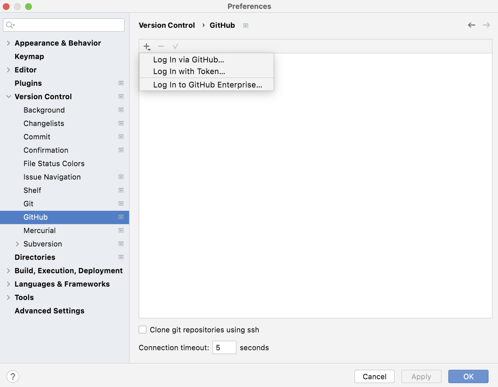
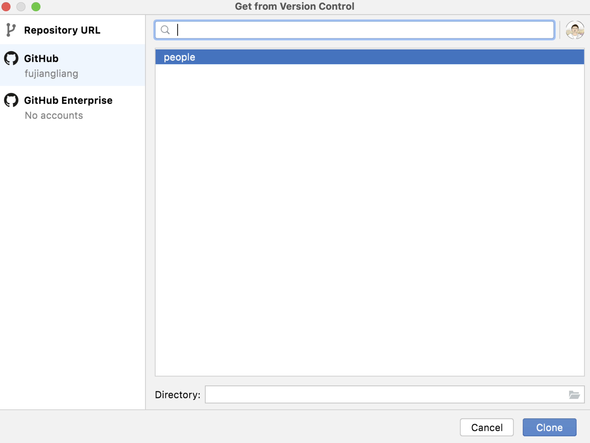
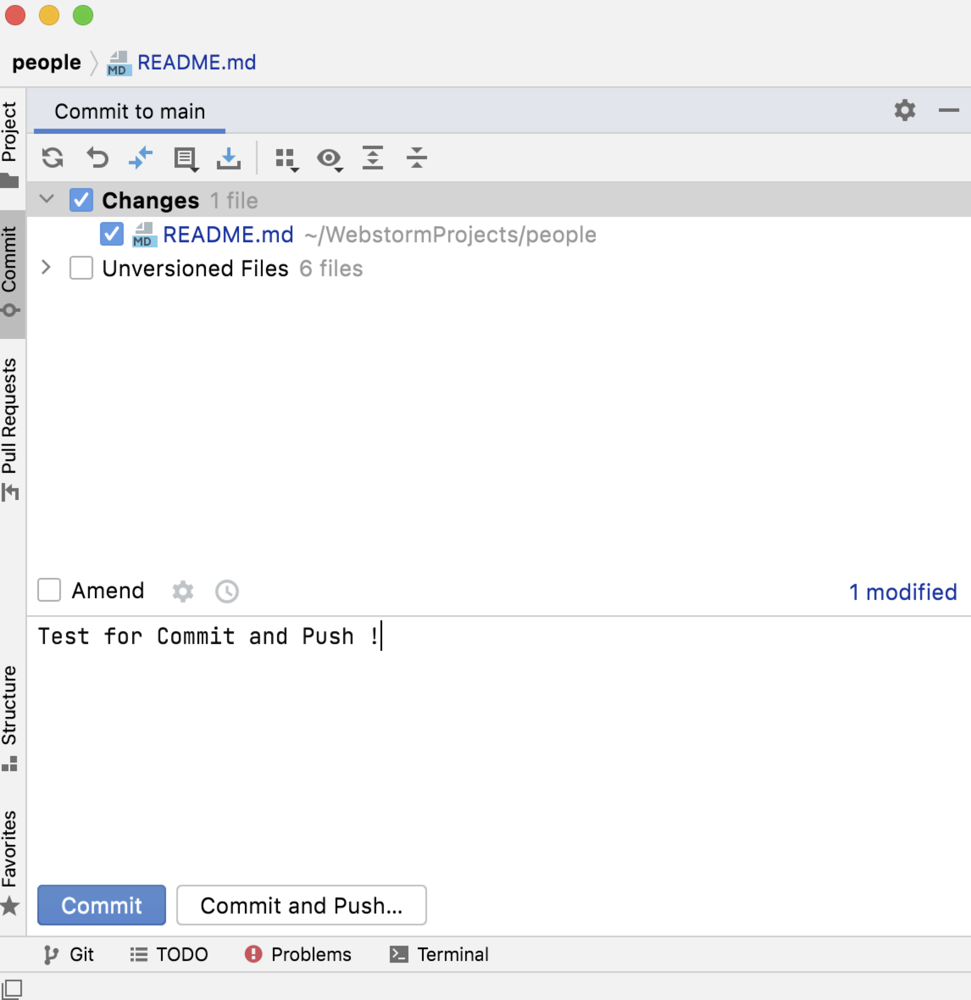

# My personal website

https://fujiangliang.github.io/people/

---
## Get started
#### 1. Register your GitHub account in WebStorm
* Install [WebStorm](https://www.jetbrains.com/webstorm/)
* Open the IDE settings and select **Preferences** | **Version Control** | **GitHub**
* Click **+** and select **Log In via GitHub**

#### 2. Clone GitHub Project From Version Control

#### 3. Commit and Push
* After doing some changes, click **Git** | **Commit**. 
* Specify commit message, and run **Commit and Push** 
* Now see how your website changes !

